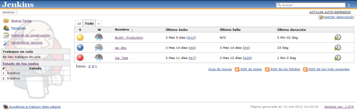

# 1.1 Run Jenkins as-is

To use the "standalone" Jenkins distribution which requires a minimum of Java 7, though Java 8 is recommended. A system with more than 512MB of RAM is also recommended.

1. Run Jenkins with the command `java -jar jenkins.war`.
2. To change the default port of the web interface of Jenkins, use the argument`--httpPort=$port`.  

For example,`java -jar jenkins.war --httpPort=12345`

It takes hardly a minute to run as a service for current user and you can run whenever required without any administrative rights.

1. Open url`http://server:port`in browser to configure Jenkins. In the last example, it is`http://localhost:12345`.
2. Download and install plugins following the steps below.
   1. Switch to the`available`tag and search for the plugin. 
   2. In this example, the`Github Project`plugin is installed to integrate Jenkins with projects on github.
   3. Click on the`install`button
3. After the installation is finished, you can configure jobs to use existing Github projects.

## Stop Jenkins

To stop the jenkins which has been started from the command prompt we need to type keys with a combination &lt;Ctrl+C&gt; and type 'Y' to stop the service.

> Remember the settings of jenkins will not be saved unless you install it as a service.

However jenkins has been improved year-on-year and now it is the most stable continuous integration server as on date.

