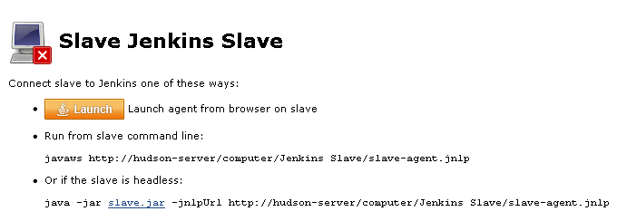

# 2.1 Configure Jenkins Slave

Jenkins supports running distributed builds, so you can run your jobs on remote machines from Jenkins. You can also use slave computers to run tests after the build. Before running a tests or your jobs on slave computers, you need to configure them as Jenkins nodes. We recommend using Java Web Start to connect to slave nodes, because you may encounter a large number of issues when connecting them as a windows service.

## Launching Jenkins Slave Agent via Java Web Start {#launching-jenkins-slave-agent-via-java-web-start}

To connect to a node via Java Web Start, you will need to launch the Jenkins agent on the slave machine. To do this, log on to your slave computer and open the[http://MasterName:8080/computer/NodeName/web](http://MasterName:8080/computer/NodeName/web) page in the browser.

Then, click Launch, or launch the slave agent using the command line provided by Jenkins.

To automate the launch via Java Web start, you can install Jenkins as a service from the **Jenkins slave agent**. To do this, launch it using the methods above and click **File \| Install as a service**. If your tests interact with the GUI, set up the Run interactive user session option in the Test build step in Jenkins, otherwise they will fail.

| Under Windows 8 and later Windows versions, Tests needs elevated permissions by default. The Java Web Start agent application cannot start it with needed permissions, but the service can. You can also disable support for testing Windows Store applications and launch TestComplete with user level permissions. |
| :--- |
|  |

Another option is to add the downloaded .jnlp file to startup \(you will need to add the slave agent's certificate to trusted certificates\) and enable auto-login following the [MSDN instructions](http://support2.microsoft.com/default.aspx?scid=kb;en-us;324737). In this case Jenkins will connect to the user session, so you do not need to select the Run interactive user sessionoption.

## Launching Jenkins Slave Agent as Windows Service on Slave {#launching-jenkins-slave-agent-as-windows-service-on-slave}

To connect to a slave node using this method, you need to set up a slave computer name, user password and login in the slave node settings. Such connection does not require any preliminary setup on the slave node. However, this method has some issues:

* You may experience issues with connecting to the slave computer. If you do, refer to the following web page for the list of possible errors and ways to fix them:

  [https://wiki.jenkins-ci.org/display/JENKINS/Windows+slaves+fail+to+start+via+DCOM](https://wiki.jenkins-ci.org/display/JENKINS/Windows+slaves+fail+to+start+via+DCOM)

* Jenkins will run on the slave as a service under the System account. To run tests that interact with GUI, you will need to set up the [Run interactive user session](https://support.smartbear.com/testcomplete/docs/working-with/integration/jenkins/running-tests.html#Interactive) option in the Test build step.

