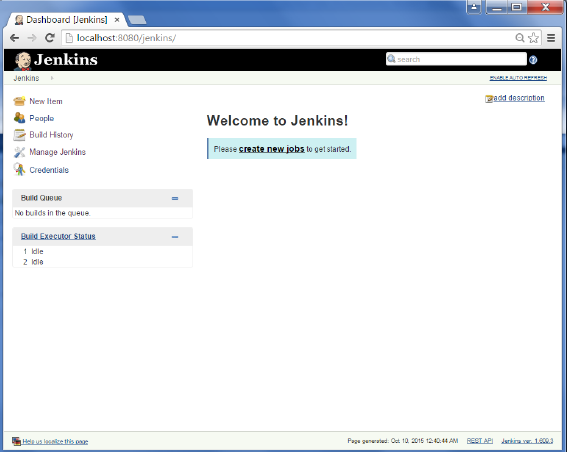
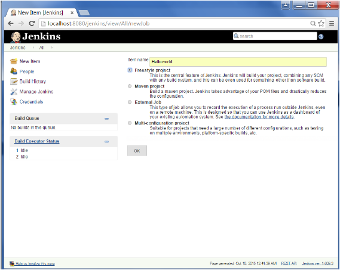
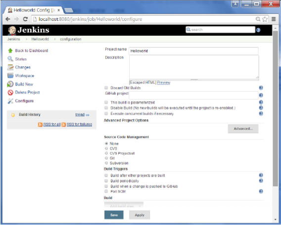
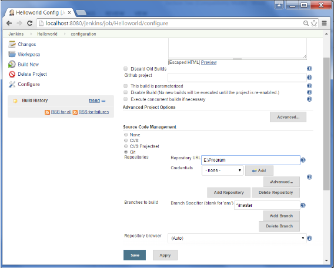
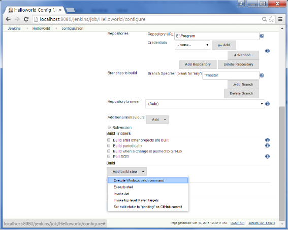
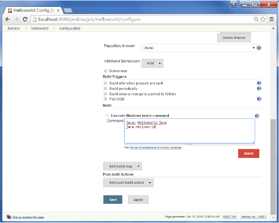
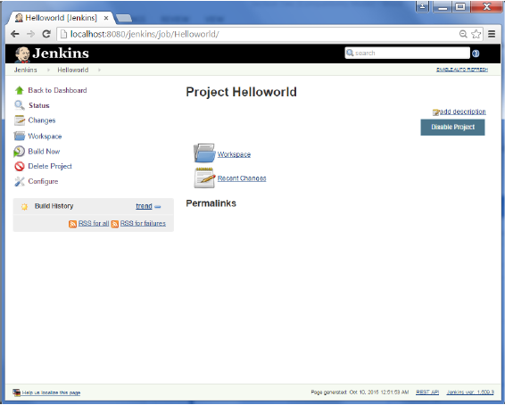

# 3.1 Create jobs

we will create a job in Jenkins which picks up a simple HelloWorld application, builds and runs the java program.

**Step 1**− Go to the Jenkins dashboard and Click on New Item



**Step 2**− In the next screen, enter the Item name, in this case we have named it Helloworld. Choose the ‘Freestyle project option’



**Step 3**− The following screen will come up in which you can specify the details of the job.



**Step 4**− We need to specify the location of files which need to be built. In this example, we will assume that a local git repository\(E:\Program\) has been setup which contains a ‘HelloWorld.java’ file. Hence scroll down and click on the Git option and enter the URL of the local git repository.

**Note**− If you repository if hosted on Github, you can also enter the url of that repository here. In addition to this, you would need to click on the Add button for the credentials to add a user name and password to the github repository so that the code can be picked up from the remote repository.



**Step 5**− Now go to the Build section and click on Add build step → Execute Windows batch command



**Step 6**− In the command window, enter the following commands and then click on the Save button.

```text
Javac HelloWorld.java
Java HelloWorld
```



**Step 7**− Once saved, you can click on the Build Now option to see if you have successfully defined the job.



