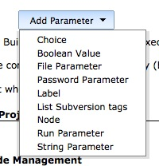
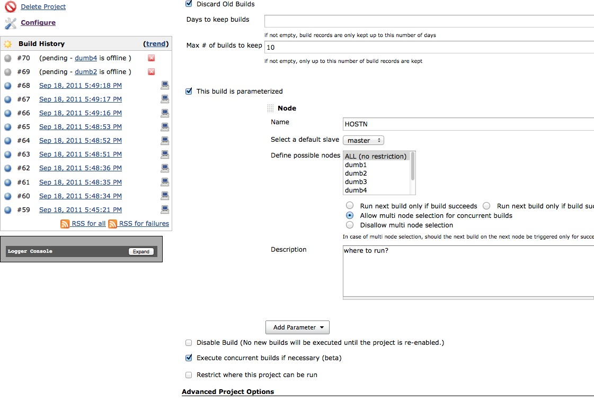
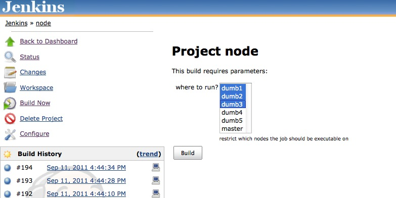

# 3.3 Run Single Job Parallely in Multiple slaves

There are two ways to accomplish this

1. Using Node Label Parameter plug-in
2. Using Multi- Configuration project + Axis plug-in
3. **Node Label Parameter plug-in :** Install the plug-in, under 'this build is parameterized option', you will find an option for specifying a list of Nodes as a drop down, and then to execute them serially or execute them on multiple nodes parallely, when you select Build option.
4. **Multi-Configuration and Axis Plug-in :** Install both these plug-ins. Create Multi-configuration Jenkins job and then you can create a virtual matrix where the job can run the job on all the nodes identified by a common label. \(You need to specify the common label name in all the nodes created \(Manage nodes --&gt; Node name --&gt; Configure\)\)

> Restrict where this project can be run
>
> If your using a node or label parameter to run your job on a particular node, you should not use the option "Restrict where this project can be run" in the job configuration - it will not have any effect to the selection of your node anymore!

## Pre-Requisite Step {#NodeLabelParameterPlugin-Node}

Below is the process to run a single job using Node Label Parameter plug-in

1.Add the Node parameter in Job Configuration.

1. Define a list of nodes on which the job should be allowed to be executed on. A default node used for scheduled jobs can be defined. You are able to configure the job to run one after the other or even concurrent.

Save the Job Configuration and Build the Job according to your requirement.

**Step 1**− If multi node selection was enabled, you get the chance to select multiple nodes to run the job on. The job will then be executed on each of the nodes, one after the other or concurrent - depending on the configuration.

**Step 2**− Click on the **Build History** link to see the details of the builds running a Single Job simultaneously in Multiple slaves based on the above selection of nodes to run on.

**Step 3**− Once the build is completed, a status of the build will show if the build was successful or not. In our case, the following build has been executed successfully. Click on the \#195 and \#196 in the Build history to bring up the details of the build.

