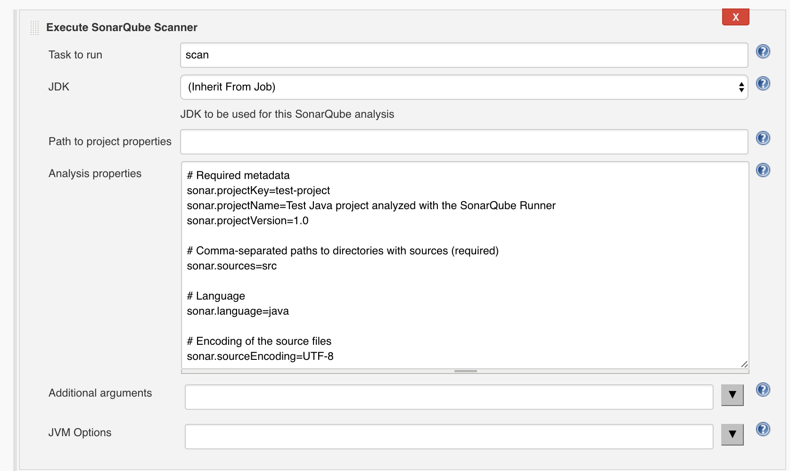
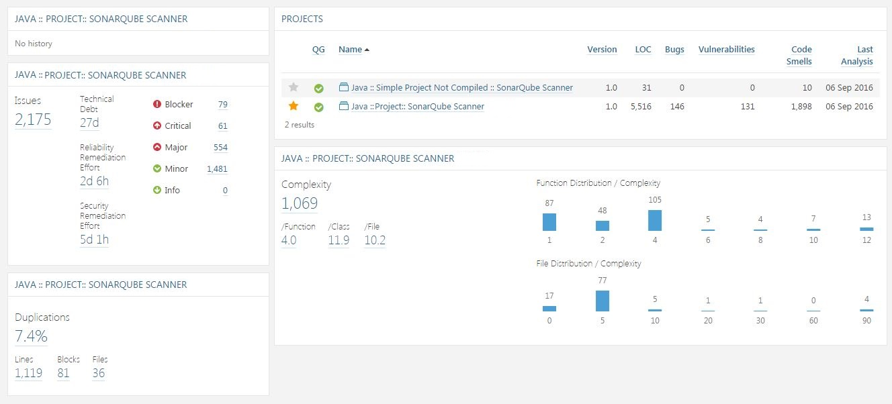

# 4.1 Analysis with SonarQube using Jenkins

> _**Pre-requisite is to configure**_ [_**SonarQube with Jenkins**_](https://nsaikiran.gitbooks.io/jenkins/content/Jenkins%20Configurations/22-configure-sonarqube-with-jenkins.html)

## **Job Configuration**

1. **Configure** the project, and scroll down to the **Build** section.
2. Add the \_Execute the SonarQube Scanner \_build step to your build.
3. Configure the SonarQube analysis properties. You can either point to an existing _**sonar-project.properties**_ file or set the analysis properties directly in the **Analysis properties**  field.

Now build the job to get the tests analysed and run the tests instantly.

After the tests are run the code analysis result can be found in sonarQube dashboard.

This is the beginning for learning to analyse the code...

